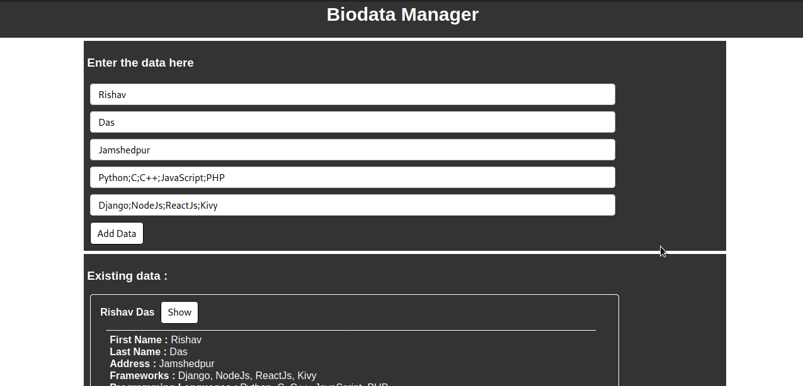
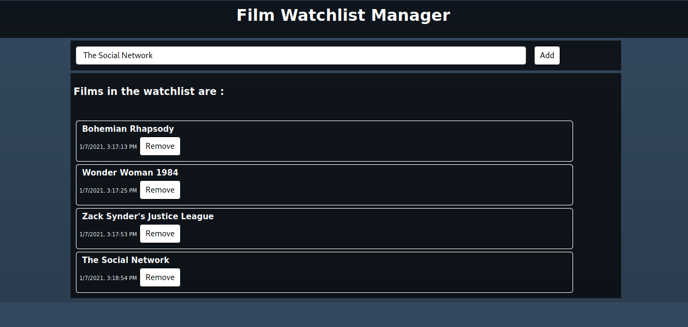

# JavaScript Projects

Below list are all the projects (applications, tools) created under this main project series. Click on the title heading to visit the folder (repository) of each projects.

### [Encrypter (VanillaJs)](https://github.com/rdofficial/VanillaJsEncrypter/)

The project includes a tool ( a single web page ) whose feature is to encrypt the user entered string with a password. The tool uses vanilla javascript for its functionalablity and HTML CSS for the web page structure part. The making of the tool is very simple, but the hard part is the mathematical algorithm for the encryption. Below is a working screenshot image for the application is shown below. 

### [Notes Manager (VanillaJs)](https://github.com/rdofficial/VanillaJsNotesManager/)

The project is a single web page tool, made using Vanilla javascript. The main purpose of this application is to store the notes. The unique thing about this tool is that it provides the feature of encryption for each notes with different passwords. Also note that the application does not make use of a database or a cloud server for storage of the notes data. All the data are stored in the local storage (cache data) of the browser. This reduces the efforts of the programmer to maintain the code and also makes learning easy. Below is a working screenshot image for the application is shown below. 

### [Instagram Fetcher (VanillaJs)](https://github.com/rdofficial/VanillaJsInstagramFetcher/)

The project is a single web page application, made using Vanilla javascript. The function that the application serves is to fetch down the public information about an instagram account. Just enter the username of the instagram user which you want to fetch, and then you get it on the web page result. The application also makes the use of the local storage of the web browser to save the data of fetched user for the current session in order to prevent the recursive fetching of data of same user from the instagram server. The instagram server blocks the access, when there are recursive HTTP requests on their server's api. So, we have implemented this function in order to prevent the access blockage. The concepts of javascript that you can learn by making this project are : _HTTP requests using fetch()_, _Using the local storage of the web browser_. Below is a working screenshot image for the application is shown below. 

### [Biodata Manager (VanillaJs)](VanillaJsBiodataManager/)

This project is a single web page application, made using Vanilla javascript. The application serves the feature of storing the biodata inputs of different users in the local storage, you can simply enter your bio data and save it. The input fields of the bio data section are very less and not that good. This project is just for learning purposes, if you want more, you can add more input fields as per your choice. Also don't forget to change the other information and codes for this purpose. The project also uses very less UI, the designing part is left on the users, they can design in whatever way they want. The items already saved in the data (in local storage of web browser) are displayed on the HTML document using the javascript HTML DOM manipulation. By doing this project, freshers in javascript programming can learn concepts like : _Handling JSON data_, _Local storage handling_, _HTML form handling_, and also _HTML element event listener_. Below is a working screenshot image for the application is shown below. 

### [Film Watchlist Manager (VanillaJs)](VanillaJsFilmWatchlistManager/)

This project is a single web page application, made using Vanilla javascript. The application serves the feature of storing the film watchlist data. The user can enter the film name, and then the film name is inserted into the watchlist data. The current time and date are also saved along with the film name. The application does not make use of any database or a remote cloud storage, it simply makes the use of the local storage of the web browser in order to store the watchlist data. The items already saved in the data (in local storage of web browser) are displayed on the HTML document using the javascript HTML DOM manipulation. By doing this project, you can learn the practical application of concepts like  _Handling JSON data_, _Local storage handling_, _HTML form handling_, and also _HTML element event listener_. Below is a working screenshot image for the application is shown below. 

### [Marvel Sups Fetcher (VanillaJs)](https://github.com/rdofficial/VanillaJsMarvelSupsFetcher/)

Still in making...Please wait!!!

### [Stone-Paper-Scissors (VanillaJs)](https://github.com/rdofficial/VanillaJsStonePaperScissors/)

Still in making...Please wait!!!

### [Login System (NodeJs)](NodeJsLoginSystem/)

This project is a login system web application, made using NodeJs framework. The NodeJs is a backend javascript language used for creating web application. The login system web application implements the use of session for user account logins. Here different users can create their particular accounts with specific usernames and passwords, they can further login into their account. The application does not uses a database to store the user account credentials, instead it uses the JSON files to store the user account data. The web application only does allows to create new accounts, login and home page. There are no additional features served, the application / project is intended for learning purposes and this can be a perfect project for beginners in web developement. The frontend designing is relied on Bootstrap, you can further add more features and functions as per your choice. Concepts that you will learn by doing this project are :
	* Creation of web application using _Express.js_
	* Handling of POST and GET requests on an express app
	* Creating sessions in express app
	* Encryption of data with user password hashing.
	* Writting and reading JSON files on the filesystem

### [Thoughts Manager (NodeJs)](NodeJsThoughtsManager)

This project is a web application made using NodeJs framework. The web application serves the purpose of storing thoughts and notes of users, and also the application provides the user to login using their specific user accounts (with username and password). Each user gets their separate place to store their data. Each user gets to login into their account and then store or delete the thoughts. The web application makes the use of JSON files to store the web application data instead of using any database server. The frontend part of this web application is relied on Bootstrap, and further UI designs can be made by you.This project is intended for learning for beginners in web developement. The concepts that a beginner can learn while making this project are :
	* All concepts of Login System
	* Handling of data of particular user

### [Anonymous HTML Hoster (NodeJs)](https://github.com/rdofficial/NodeJsAnonHtmlHoster)

This project is a web application made using NodeJs framework. The web application serves the sole purpose of hosting HTML documents freely and without any domain restrictions. You can host your written HTML document with your specific URL and post the uploading process, the HTML file is hosted at the specified file Id. The frontend part of this web application is relied on Bootstrap, and further UI designs can be made by you. This web application is a beginner level project as well as a production level project. The project is also made in other backend languages like PHP and Django, They are too hosted on the [author's github profile](https://github.com/rdofficial). Making the application, you can grasp the following terms :
	* GET and POST request and body data handling
	* Using JSON files instead of database to store web application's data
	* Accessing and working with URL params

## About the author

All the projects are created by [Rishav Das](https://github.com/rdofficial). I am a programmer and I keep knowledge in these fields : General python, Frontend and backend (NodeJs + Express + MongoDB) javascript, C, C++, PHP, Django framework, Linux operating systems, bash scripting, and also basic hardware programming. I have created this project / set of projects for the other freshers (beginners) to learn the programming in a better way, and also learn their implementation. You can use any projects listed above as your part time or school / college project as it is free to use and share. If you want, you can also update the source code and make the applications even more better in terms of execution and designs, you can freely send me your updated verison of my email _rdofficial192@gmail.com_ or simply can pull a request. I will observe the code and update as per the code is. Also the tutorials for all projects are uploaded to [my youtube channel](https://www.youtube.com/channel/UCfp-xR7cpyLOXVW8MYr59WA/videos), you can just get access to them and experience a better practical version of all these projects. If you are a beginner to JavaScript, then I recommend you to watch them.

There are also other projects for beginners on my github profile and youtube channel, check them out as well ;-).