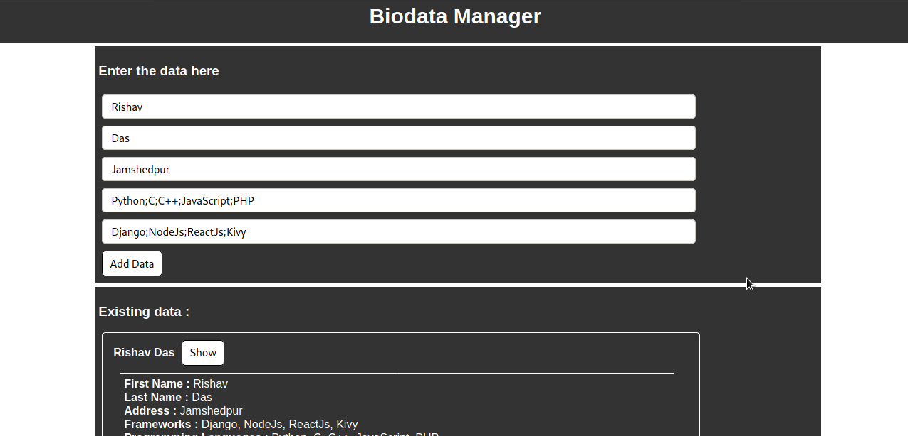

# Biodata Manager (VanillaJS)

A tool to store the biodata of the people with a very less information fields including name, address, known programming languages, and frameworks. The tool is just a beginner level project that on completion gives a better understanding of concepts and techniques for the freshers to the javascript programming. The project is a single page application made using plain javascript, HTML and CSS (only for page designs and structures). __PS :__ The tool is not worth for a production level stuff, but a very good project for beginners to javascript programming.

## Note

Before using this tool, there are some things that we should note down :
* __VanillaJs :-__ The tool is made using plain client side javascript, and thus makes a perfect project to make and learn for the beginners to javascript programming. The main programming part of the script is thus easy to understand for all beginners.

* __Usage of web browser's localStorage :-__ The tool uses the localStorage of the web browser for storing of the data, hence the data saved is no longer required to store in a remote database. We can simply save it to the local storage of our web browser using just a few lines of codes. Also, note that the data stored in the local storage of the web browser is not completely permanent.

## About the author

The tool is written by Rishav Das. I am a programmer and know python (django, general based, data science), javascript (nodeJs), PHP, C, C++. I have written this tool in intention to expertise the javascript language for the beginners. The tool does not need you to learn any server side programming or any sockets / nodes stuff. If you are new to javascript, here is your first project to start off ;-). I have made several beginner level javascript projects and all are available at my [github profile](https://github.com/rdofficial). One more thing about these projects are that the tutorials of making these projects including coding section, mathematical section are uploaded to [my youtube channel](https://www.youtube.com/channel/UCfp-xR7cpyLOXVW8MYr59WA). If you haven't checked out my videos, check them out on my channel, you would get a better practical experience for the projects.

For the contributors, if you want to update any stuff on these projects, you can just create a pull request or just mail me at _rdofficial192@gmail.com_ with the updates. I'll check it out as soon as possible.